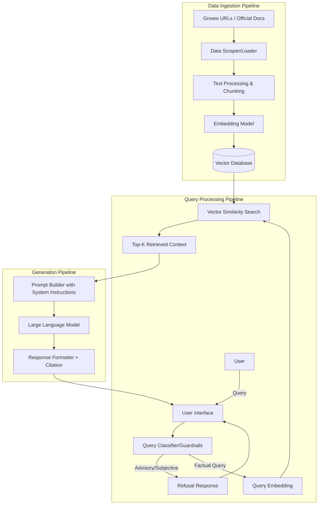

# Architecture Document: Mutual Fund FAQ Assistant (RAG)

## 1. System Overview
The Mutual Fund FAQ Assistant is built on a **Retrieval-Augmented Generation (RAG)** architecture. It is designed to ingest a curated corpus of factual information from official mutual fund pages (specifically the 5 selected HDFC schemes on Groww), retrieve the most relevant information for a user's query, and generate a concise, factual, and strictly cited response. 

The architecture incorporates strict guardrails to refuse any queries requesting investment advice, comparisons, or subjective opinions.

## 2. High-Level Architecture Diagram

## 3. Core Components

### 3.1. Data Ingestion Pipeline
This pipeline runs periodically (or offline) to process the corpus and store it for retrieval.
- **Data Loader**: Scrapes and extracts text from the 5 selected Groww URLs and any supplementary official documents (like Factsheets, KIM, SID).
- **Text Splitter/Chunker**: Splits the extracted documents into smaller, semantically meaningful chunks (e.g., 500-1000 tokens) to ensure the retrieved context is focused and fits within the LLM's context window. Metadata (source URL, document type) is attached to each chunk.
- **Embedding Model**: Converts the text chunks into dense vector representations.
- **Vector Database**: Stores the embeddings and metadata, allowing for rapid similarity searches.

### 3.2. Query Processing & Retrieval Pipeline
This is the real-time system that handles user queries.
- **Query Classifier (Guardrail)**: A fast, lightweight check (either rule-based or using an LLM prompt) to determine if a query is factual or advisory.
  - If advisory (e.g., "Should I invest in HDFC Mid Cap?"), it triggers a predefined refusal response directing the user to educational resources.
  - If factual, it proceeds to the retrieval stage.
- **Query Embedding**: The user's query is converted into a vector using the same Embedding Model as the ingestion pipeline.
- **Vector Search**: The system queries the Vector Database to find the top-K chunks that have the highest cosine similarity to the user's query.

### 3.3. Generation Pipeline
This component takes the retrieved context and generates the final response.
- **Prompt Builder**: Constructs a prompt combining:
  1. Strict system instructions ("You are a factual assistant. Do not give advice. Answer in max 3 sentences. Only use the provided context.").
  2. The Top-K retrieved chunks (along with their source URLs metadata).
  3. The user's original query.
- **LLM Engine**: Generates the final answer strictly based on the provided context.
- **Response Formatter**: Ensures the output meets the project constraints:
  - Verifies sentence count (max 3 sentences).
  - Appends the single citation link from the context metadata.
  - Appends the required footer: `“Last updated from sources: <date>”`.

### 3.4. User Interface
A minimalistic, clean web interface containing:
- A welcome message outlining the bot's capabilities.
- 3 clickable example queries.
- A prominent disclaimer: **“Facts-only. No investment advice.”**

## 4. Proposed Technology Stack (Example)
- **Programming Language**: Python
- **Orchestration Framework**: LangChain or LlamaIndex
- **Embedding Model**: BGE Model (e.g., `BAAI/bge-large-en-v1.5`)
- **Vector Database**: ChromaDB, FAISS, or Pinecone
- **LLM Engine**: Groq API (e.g., `llama3-70b-8192` or `mixtral-8x7b-32768`)
- **User Interface**: Streamlit or Gradio

## 5. Security & Privacy Constraints
- **No PII Storage**: The system does not request or store any Personally Identifiable Information (PAN, Aadhaar, account numbers, OTPs, emails).
- **Stateless Operation**: To maximize privacy, queries can be processed statelessly without retaining user-specific session history beyond the immediate query context.
